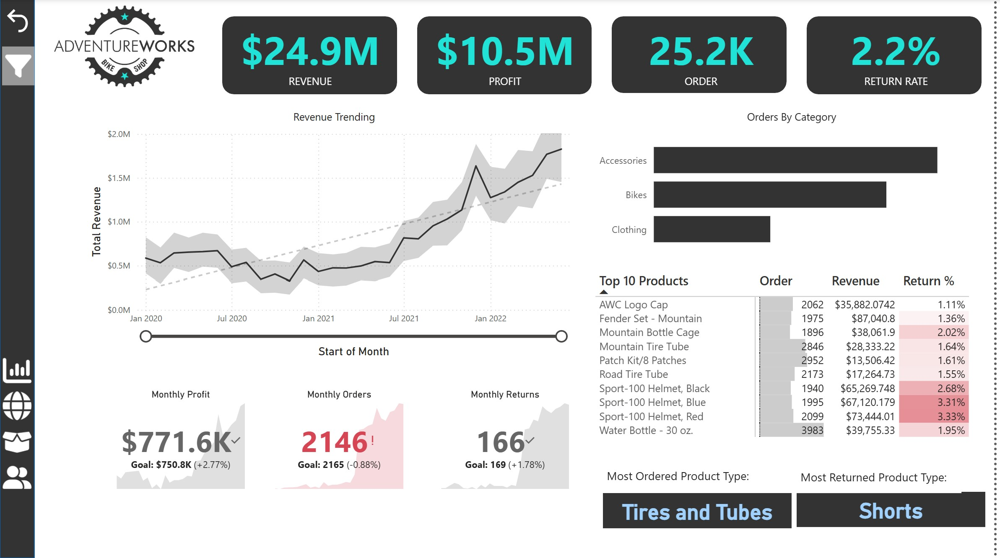

# AdventureWorks Sales Dashboard (Power BI)

This repository contains a Power BI dashboard built using the **AdventureWorks dataset**.  
The dashboard provides insights into **Revenue, Profit, Orders, and Return Rates** with interactive visuals for better decision-making.

---

## 📊 Dashboard Overview
The dashboard helps to analyze:
- **Revenue Trends** over time
- **Profit** performance
- **Number of Orders**
- **Return Rate (%)**
- Orders by **Category**
- **Top 10 Products** (with revenue & return %)
- **Most Ordered** and **Most Returned** product types

---

## 🖼 Dashboard Preview


---

## 📁 Repository Contents
- `AdventureWorks_Sales.pbix` → Main Power BI report file  
- `01.jpg` → Dashboard preview image (screenshot)  
- `data/` → Sample dataset (if applicable)  
- `README.md` → Project documentation  

---

## 🚀 How to Use
1. Clone or download this repository.  
   ```bash
   git clone https://github.com/username/AdventureWorks-Sales-Dashboard.git
